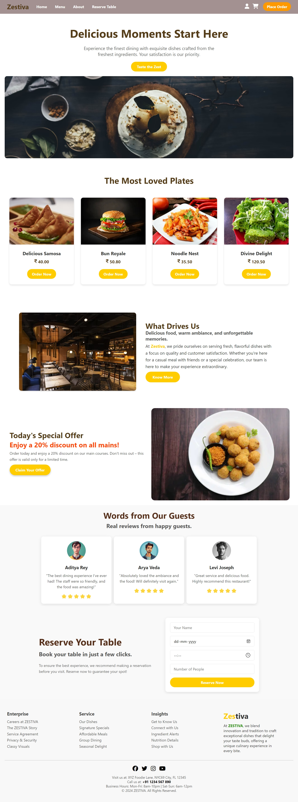

# Zestiva Restaurant Website 🍽️

Welcome to the **Zestiva Restaurant Website** repository! This project showcases a modern, responsive, and visually appealing website for a restaurant, complete with key features to enhance the user experience.

## View Website  
[Zestiva Restaurant Website](https://get-unknown-err0r.github.io/zestiva-restaurant-website/)  
---
## Output



## 🌟 Features  

- **Responsive Navbar**  
  - Logo, links, and icons for user profile and cart.  
  - Mobile-friendly hamburger menu.  

- **Welcome Section**  
  - A stunning hero section with a tagline, description, and an image to captivate visitors.  

- **Popular Dishes Section**  
  - Highlighting the most loved dishes with images, prices, and "Order Now" buttons.  

- **About Us Section**  
  - A brief introduction to the restaurant's values and mission with text and image content.  

- **Special Offers Section**  
  - Highlighting limited-time discounts with a call-to-action button.  

- **Testimonials**  
  - Real reviews from happy customers with images and star ratings.  

- **Reservation Section**  
  - An easy-to-use reservation form for booking tables.  

- **Footer**  
  - Links to enterprise info, services, and insights.  
  - Social media icons, contact details, and business hours.  

---

## 🛠️ Technologies Used  

- **HTML5**: For structuring the website.  
- **CSS3**: For styling and responsiveness.  
- **Font Awesome**: For attractive icons.  
- **Google Fonts**: For elegant typography.  

---

## Clone The Repository
   ```bash
   git clone https://github.com/GET-UNKNOWN-ERR0R/zestiva-restaurant-website.git
   ```
   ```bash
   cd zestiva-restaurant-website
   ```
## License
   This project is licensed under the MIT License.
